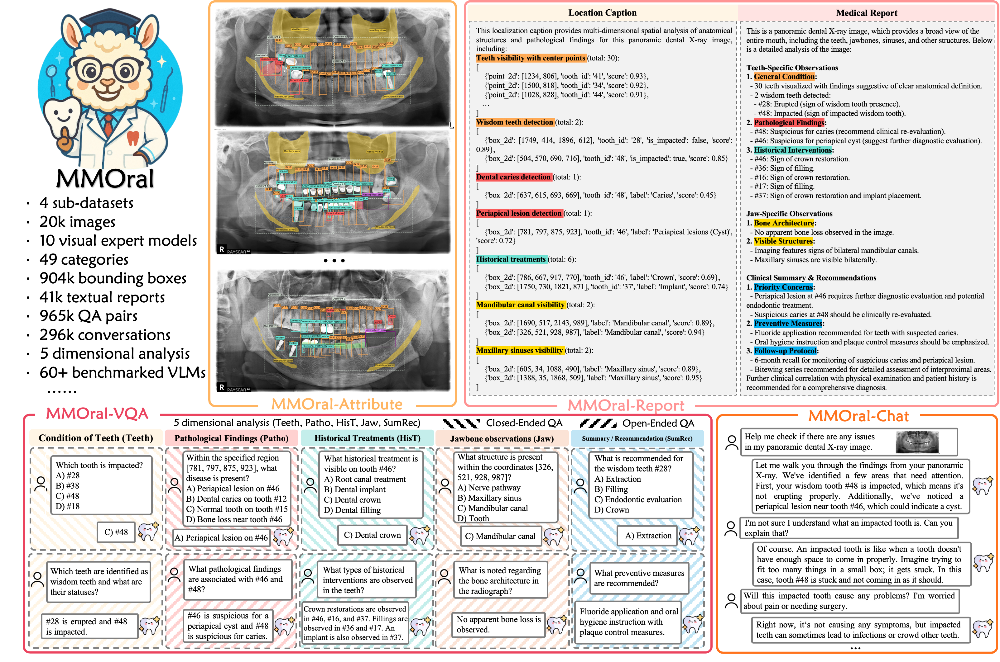

# OralGPT 👄🦷  

***OralGPT**: An Omni Multimodal Large Language Model for Digital Dentistry*

<div align="center">
  
</div>

<div align="center">
  
  <br><br>

  <!-- 链接部分 -->
  <a href="https://arxiv.org/pdf/2509.09254" target="_blank">📄 <b>Paper</b></a> &nbsp;|&nbsp;
  <a href="https://huggingface.co/OralGPT" target="_blank">
    🤗 <b>Dataset on Hugging Face</b>
  </a>

  <br><br>
  📣 If you like our work, please give us a ⭐ on GitHub!  
</div>

---

## 📖 Table of Contents  
- [Introduction](#-introduction)  
- [News](#-News)
- [Upcoming Updates](#-upcoming-updates)
- [Released Materials](#-released-materials)
- [MMOral-Bench](#-mmoral-bench)  
- [Citation](#-citation)  

---



## ✨ Introduction

**OralGPT** is a **series multimodal large language model (MLLM) specialized in digital dentistry**. It supports diverse dental imaging modalities, including:  

- Intraoral images & videos  
- Photographs  
- Panoramic X-rays 
- Periapical radiographs  
- Cephalometric radiographs  
- Histopathological slides  
- Textual Question & Conversation  

OralGPT aims to be the foundation MLLM for AI-driven digital dentistry — bridging multimodal reasoning with clinical expertise. With **Chain-of-Thought (CoT) reasoning**, OralGPT simulates the diagnostic process of radiologists, ensuring outputs that are **interpretable, trustworthy, and clinically reliable**.  

---

## 🔔 News 
- **[2025-09-22]** 🚀 Multiple **Dental Visual Expert Models** have been released on 🤗 [Hugging Face](https://huggingface.co/Bryceee/Teeth_Visual_Experts_Models). 
- **[2025-09-19]** 🎉 Our paper of **OralGPT** has been accepted by **NeurIPS 2025**. 
- **[2025-09-11]** 🎉 Our paper of **OralGPT** has been released on [arXiv](https://arxiv.org/abs/2509.09254).  
- 🔜 We are actively developing **MMOral-Bench v2**, which will include:  
  - ✅ More dental imaging modalities  
  - ✅ Professional dentistry exam questions  
  - ✅ Comprehensive evaluation of multiple MLLM performance in digital dentistry
- 🤝 For collaboration inquiries, please contact us at: 📮 isjinghao@gmail.com

---

## 🔮 Upcoming Updates  

- 📦 Release of **MMOral-Bench v2**  
- 📑 Expanded **instruction dataset** with more diverse dental imaging modalities
- 🧪 Release of **OralGPT-o3**

---

## 🚀 Released Materials

1. Multiple **Dental Visual Expert Models** released on 🤗 [Hugging Face](https://huggingface.co/Bryceee/Teeth_Visual_Experts_Models)
, covering detection, segmentation, and classification tasks in panoramic/periapical X-ray images.
2. 👉 Coming soon ...
---


## 📏 MMOral-Bench  

Currently, you can evaluate your MLLM’s performance on **panoramic X-ray analysis** using **MMOral-Bench**.  
All benchmark data are **reviewed and validated by professional clinical dentists**, ensuring **accuracy and clinical reliability**.  

### Performance
<div align="center">
  
</div>

### Evaluation of MMOral-Bench

Our benchmark consists of both Open-Ended and Closed-Ended evaluation formats, with corresponding TSV files available at [https://huggingface.co/datasets/EasonFan/MMOral-Bench](https://huggingface.co/datasets/EasonFan/MMOral-Bench).

For benchmark evaluation, we provide two approaches:

1. Using [**VLMEvalkit**](https://github.com/open-compass/VLMEvalKit) (supporting multiple pre-configured VLMs)
2. For VLMs not available in VLMEvalkit or new VLMs, we provide generic evaluation scripts: `eval_MMOral_VQA_Closed.py` and `eval_MMOral_VQA_Open.py`

#### Using VLMEvalkit

We offer a zip file which includes the version we use to evaluate the VLMs on the MMOral-Bench. We have included an `mmoral.py` file in the `vlmeval/dataset` directory. To evaluate any model supported by VLMEvalkit:

1. Modify the `mmoral_config.json` file with your desired settings
2. Run `bash run_eval.sh` to start the evaluation

#### Using Generic Evaluation Scripts

For models not supported by VLMEvalkit, you can use our generic evaluation templates. Simply add your model's inference method to either `eval_MMOral_VQA_Closed.py` or `eval_MMOral_VQA_Open.py` to conduct the evaluation. These scripts provide a flexible framework that can accommodate any VLM implementation.

```python
#For Open-Ended Evaluation
python MMOral-Bench-Eval/eval_MMOral_VQA_Open.py \
  --benchmark_path '/path/to/your/MM-Oral-VQA-Open-Ended_processed.tsv' \
  --output_dir '/path/to/save/evaluation_results_open-4o' \
  --gpt_api_key 'your_api_key_here' \
  --gpt_api_base 'https://your-gpt-api-endpoint.com/v1/chat/completions' \
  --dataset_name 'MM-Oral-VQA-Open-Ended' \
  --model_name 'gpt4o'

#For Closed-Ended Evaluation
python MMOral-Bench-Eval/eval_MMOral_VQA_Closed.py \
  --benchmark_path '/path/to/your/MM-Oral-VQA-Closed-Ended.tsv' \
  --output_dir '/path/to/save/evaluation_results' \
  --api_url 'https://your-gpt-api-endpoint.com/v1/chat/completions' \
  --api_key 'your_api_key_here' \
  --dataset_name 'MM-Oral-VQA-Closed-Ended' \
  --model_name 'gpt4o'
```

This streamlined process allows you to easily benchmark any VLM against our MMOral-Bench dataset.

## 📌 Citation  

If you find our work helpful, please cite us:  

```bibtex
@article{oralgpt2025,
  title={Towards Better Dental AI: A Multimodal Benchmark and Instruction Dataset for Panoramic X-ray Analysis},
  author={Hao, Jing and Fan, Yuxuan and Sun, Yanpeng and Guo, Kaixin and Lin, Lizhuo and Yang, Jinrong and Ai, Qi Yong H and Wong, Lun M and Tang, Hao and Hung, Kuo Feng},
  journal={arXiv preprint arXiv:2509.09254},
  year={2025}
}
